https://www.youtube.com/watch?v=tTiWRWCc0Aw
# RESTful WEB API

RESTful - API спроектирован с использованием архитектурного стиля REST
REST - набор правил и ограничений для того как использовать HTTP протокол для коммуникации между клиентом и приложением
HTTP - сам протокол передачи данных по сети

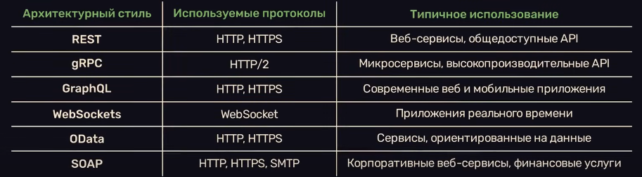

Зачем проектировать API?

Хороший дизайн API помогает приложению быть удобным, безопасным, легко поддерживаемым и изменяемым.

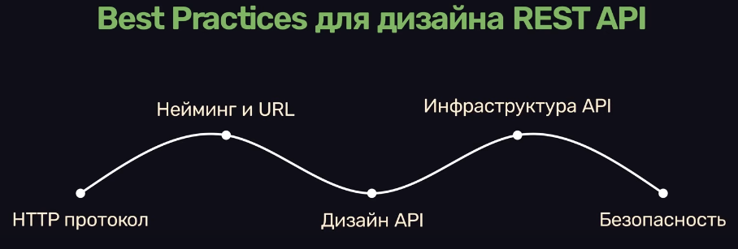
## Советы:
### HTTP протокол

Методы:

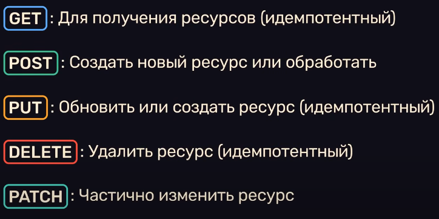
есть и другие, но в этом контексте они не важны

1. Использовать HTTP методы корректно
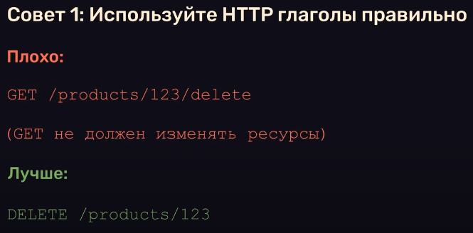

2. 
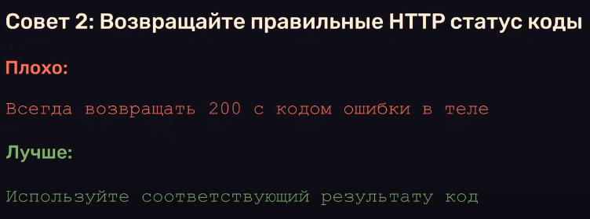
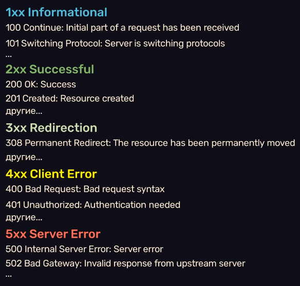

3. 
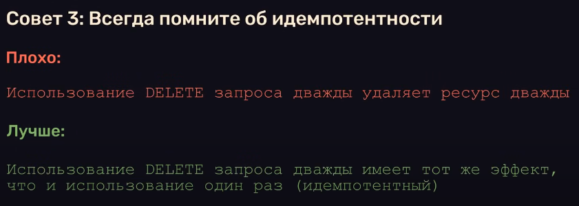
Может изменять состояние системы, но необязательно
### Нейминг и  URL

Endpoint - конкретный URL адрес, к которому клиент может обращаться для взаимодействия с сервером

1. 
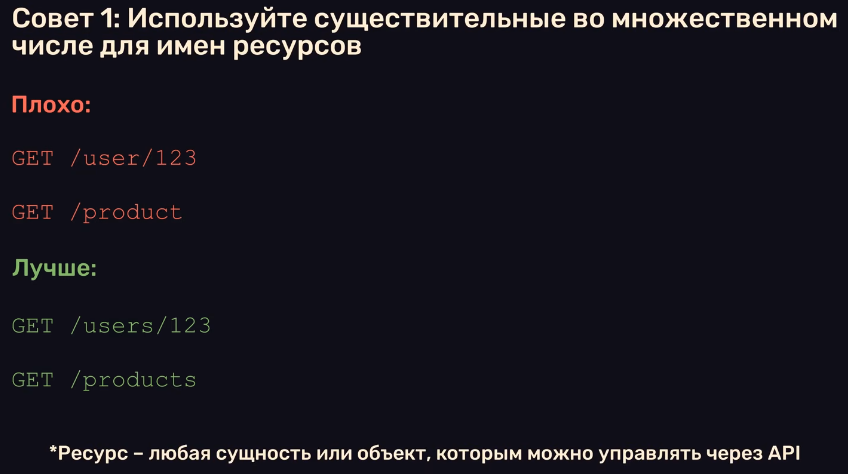

2. 
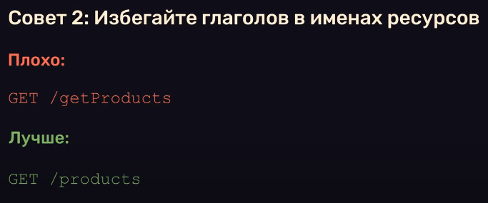

3. 
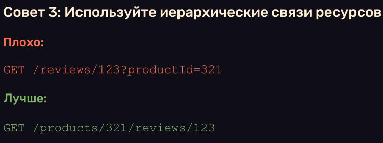

4. 
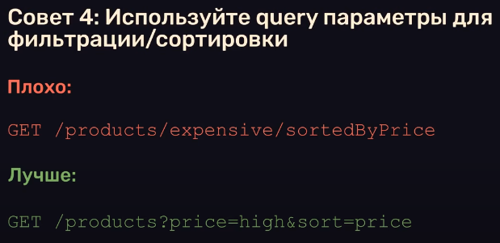

5. 
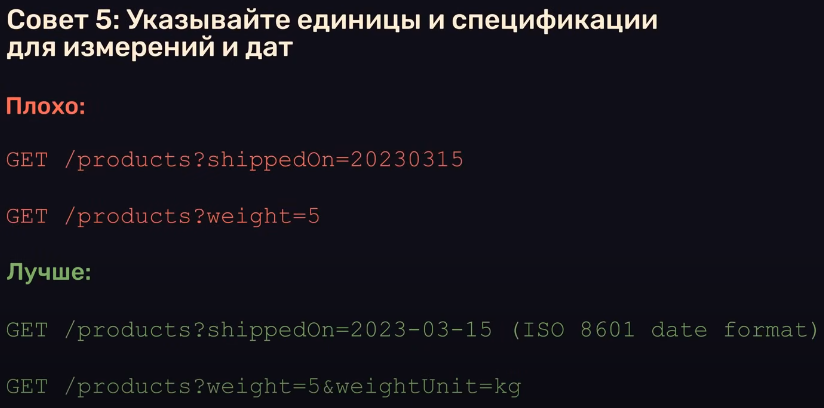

### Дизайн API

1. 
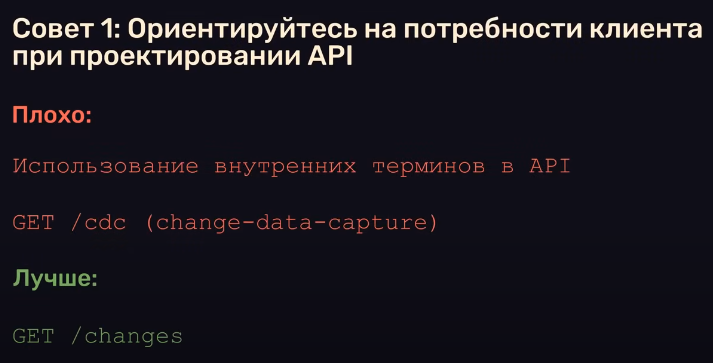

2. 
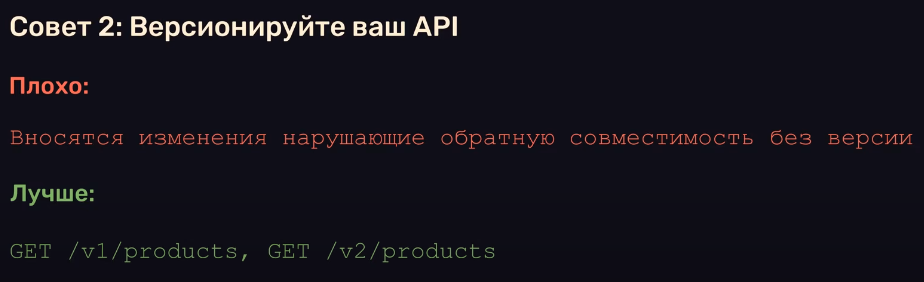

3. 
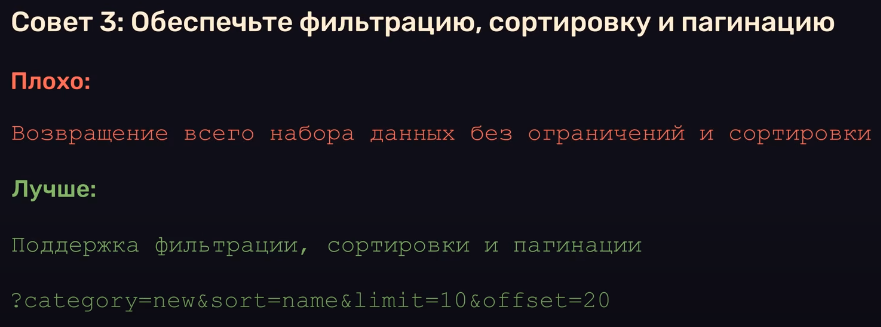

4. 
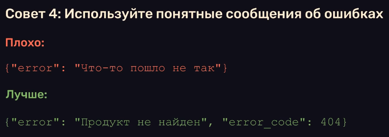

5. 
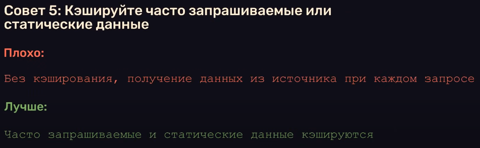

6. 
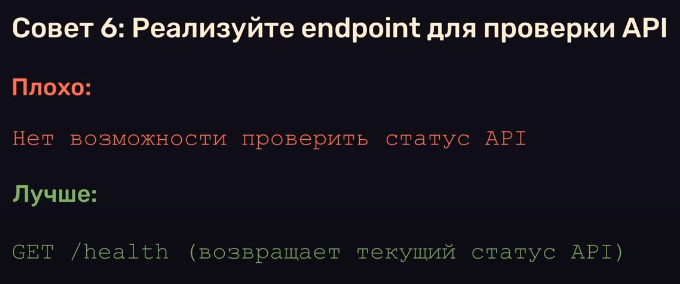

### Инфраструктура API

1. 
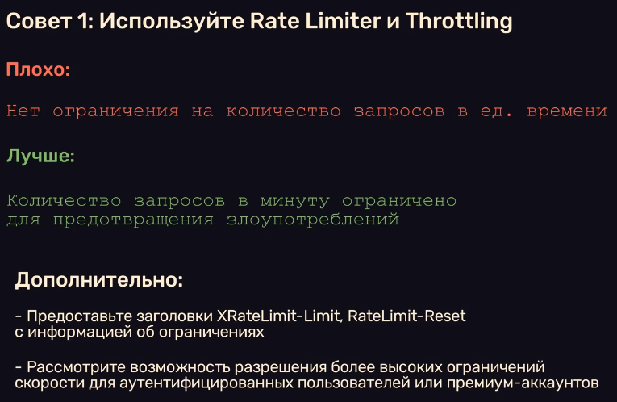

2. 
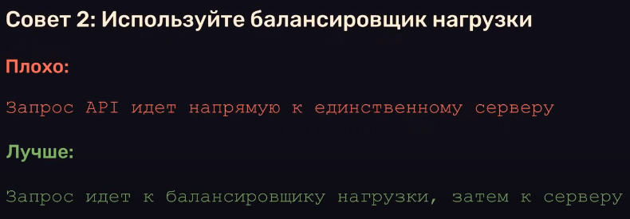
Например стратегия RR (Round Robin), но для качественной балансировки запросов между серверами все равно требуются более сложные стратегии

Балансировщики не только помогают масштабировать производительность системы, но и повышают отказоустойчивость

3. 
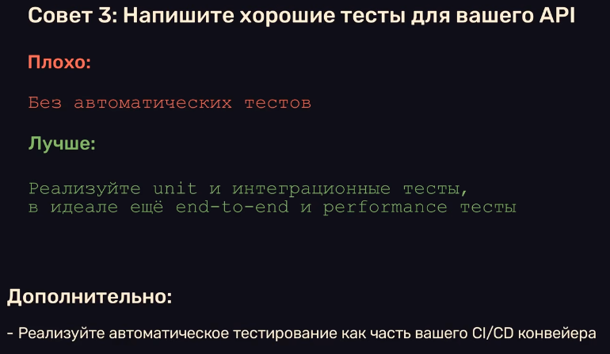
unit тесты (модульные) позволяют проверить отдельные компоненты в изоляции.

интеграционные - убедиться, что целые модули системы корректно взаимодействуют между собой. 

сквозные (end-to-end) тесты симулируют полный путь пользователя

4. 
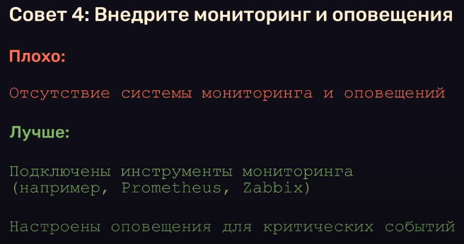
Grafana для визуализации

### Безопасность

1. 
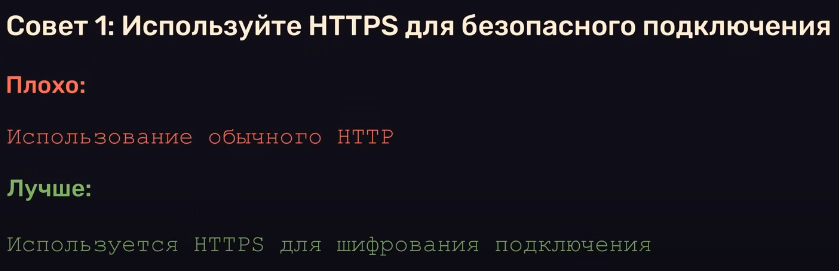

2. 
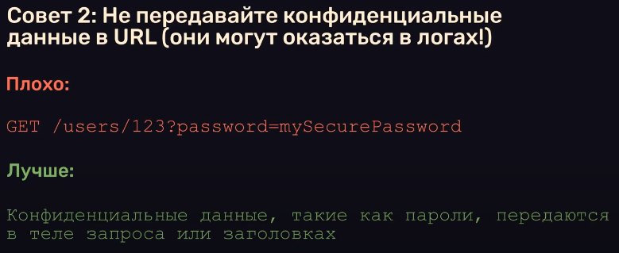

3. 
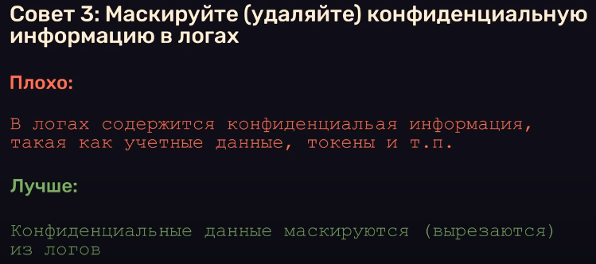

4. 
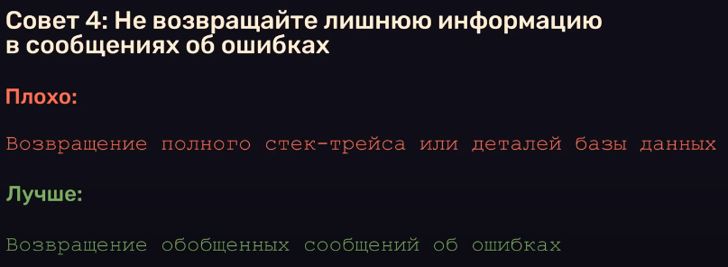

5. 
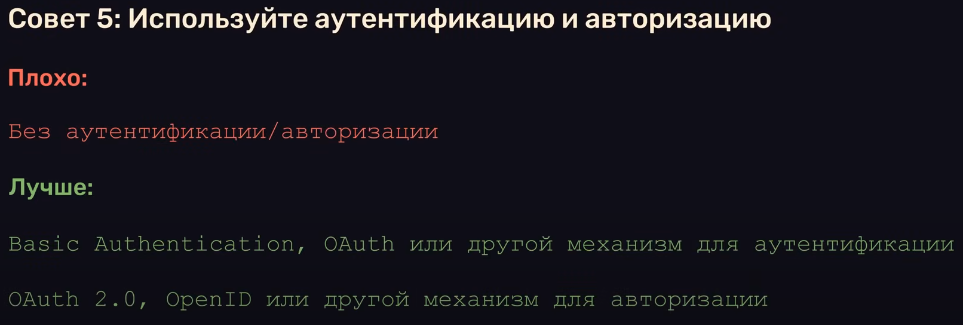
аутентификация / авторизация
что вы / что разрешено вам делать

6. 
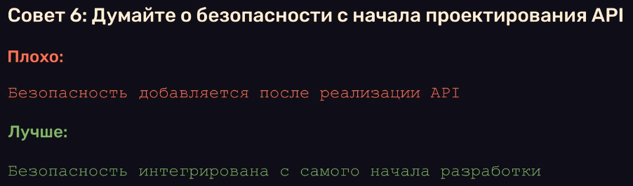