# 02_bash_1

Общая информаций о Linux
Работа с командной строкой
Файлы и папки
Пользователи и группы

что такое линукс
история
линукс vs юникс

важные концепции для работы с линукс
терминал
основные команды

Зачем пользоваться?

Весь интернет работает на линукс

План
- История и общая инфа о линукс
- Работа с командной строкой
- Файлы и папки
- Пользователи и группы

Linux = представители семейства Unix-подобных операционных систем на общем ядре

Общее ядро определяет линукс о

Что такое "Unix-подобные"?


Unix - широкое дерево ОС. BSD (MacOS, FreeBSD). Linux

История Linux 
- 1971 – Unix, Bell Labs: Кен Томпсон, Деннис Ритчи 

- 1983 – GNU, Ричард Столлман (противоречивый в ПО)

- 1991 – Ядро ОС Linux, Линус Торвальдс 

Unix way
Обозначает подход к ОС и к утилитарным вещам в ОС, которые характерны для Unix
Linux и Unix как конструкторы. Unix way позволяет из простых вещей делать чтото большое и хорошее

Слои Linux
- Hardware (железо) 

- Kernel (ядро) 
	ключевой элемент ОС для взаимодействия с железом. какието куски драйверов, высокоуровневые части для абстракции от работы железа
	
	Например видеокарта AMD и Nvidia работают по-разному, для абстракции нужны и драйвера и ядро, которое правильно работает с дровами

- Userspace (рабочее окружение)
	Самый высокий уровень. прикладные штуки. программы


Linux = лучший в мире конструктор

Из чего состоит любой Linux?

- Ядро (разных версий) 
	в зависимости от версии разный набор фичей
	
- Дистрибутив 
	готовая собранная коробка с конструктором
	
- Среда рабочего стола (по необходимости)
	графический интерфейс 

Все можно кастомизировать
Гибкость почему минус. Не все компоненты хорошо совместимы, обновляем ядро дистрибутива, то можем получить баги 

Среда рабочего стола тоже для какихто дистрибутивов подходит для какихто нет

Что такое "ядро"?

- Ядро позволяет софту и железу "общаться" 

- В ядре спрятана основная сложность операционной системы 

- Ядра бывают очень разными по возможностям, архитектуре и характеристикам


Версии ядра

Выходят новые
LTS (Long Time Support). Можно на них переходить


Дистрибутив

Linux на сервере
	могут быть боле безопасными...
/ 
Linux на десктопе
	Магазин, анимации, UX...

Редко можно найти linux которых хорош и там и там

Классические: Ubuntu, Debian, RedHat, Fedora, Mint, Arch, CentOS


Сложно выбирать дистрибутив линукса

Дистрибутивы на десктопе


Почему на десктопе так мало используют линукс


Отторжение пользователей от UX Linux
Отсутствие многих пользовательских программ (офис)
Windows часто поставляется из коробки 

Жесткие ограничения смываются, Windows(wsl), mac и linux совместим

Дистрибутивы на сервере


CentOS и RedHat похожи, их делает одна компания
CentOS - достаточно безопасна
RedHat - дорогой
Linux Alpine - маленькие, работают в контейнерах (5-15мб)

Как выбрать?

- Для десктопа: Новичок? Ubuntu, Mint
- Для сервера: вам скажет админ
	много используют k8s а там уже другая история

Среда рабочего стола (по необходимости)

Какие бывают "среды рабочего стола"? 
- Gnome 
- KDE 
- Mate 
- XFCE 
- Budgie 
- Unity (умер, но нам его жаль) убунтовский

Ядро - основа ОС, бывает разных версий, чаще всего их выбирать не приходится, будем выбирать дистрибутив (десктоп или сервер)

Многие пользователи линукс используют лишь командную строку. Почему?
Людям проще выбирать команды чем клацать мышкой
Много чего в графическом интерфейсе нет и можно в нем потеряться (1с??).
История в GUI не сохраняется

Прежде всего – Linux используют внутри командной строки*

Командная строка необходима 
на сервере только командная строка
и сейчас она стала еще сложнее изза контейнеризации и оркестрации

Linux = лучший в мире конструктор + и в строке

Portable Operating System Interface (POSIX)
Стандартизирует многие вещи которые используем в разных подвидах Unix и дистрибутивах для определения базы, но бывают исключения

- Основные определения – список основных определений и соглашений, используемых в спецификациях 

- Обоснование и принципы 

- Системные интерфейсы (на языке C) 

- Оболочка и утилиты – описание утилит и командной оболочки sh

Окружения командной строки 

- sh – самая базовая версия 
	самая posix совместимая, мало полезного для конечного пользователя вещей, очень много чего не хватает, но ==`есть везде`==
	
- bash – самая популярная версия 
	
- zsh – самая удобная 
	
- fish – самая хипстерская 
- И другие

удобные конфиги?
https://github.com/sobolevn/dotfiles/blob/master/config/zshrc

Файловая система

Папки
- pwd (print working directory)
	показывает текущую рабочую директорию
	
- cd (change directory)
	меняет текущую директорию


- mkdir (make directory)
	создает папку

Файлы
- ls (list)
	показывает cписок файлов и директорий в текущей директории
	ls .. - вывод всех файлов из родительской директории

- touch
	создание пустого файла

- mv (move)
	переименовать файл или переместить
	==`..`== - родительская папка 
	==`.`== - текущая папка
	```sh
	mv myfile.txt newfile.txt
	mv newfile.txt .. //(на уровенб выше)
	mv ../newfile.txt .
	```

- cp (copy)
	создает копию
	
	сохранение с изменениями

- rm
	удаление файла
	

флаг ==`-r`== рекурсивно папка + файлы в ней
- mv -r – двигает папку 
- cp -r – копирует папку 
- rm -r – удаляет папку (!)

Будьте осторожны! Не выполняйте! 
- rm -r / - попытается удалить диск
- rm -rf * - удалит все в текущей папке и ниже
- rm -rf . - тоже самое
- rm -rf .. - удаление всего с родительской папки

Потоки ввода и вывода ОС

Потоки 
- stdin – стандартный поток для ввода информации 

- stdout – стандартный поток для вывода, используется для вывода общей информации 
	общая информация

- stderr – стандартный поток для ошибок, используется для вывода информации и данных ошибок
	логи, инфа об ошибках...

echo (stdout)
	вывод в поток

echo >&2 (stderr)
	
	==`>`== - перенаправляем вывод
	==`&2`== - именованный поток номер 2
	Таким образом перенаправляем echo, который по стандарту пишет в stdout, в stderr

echo >
	можно перенаправлять в файл
	

cat пишется как кэт но все говорят как кат
	выведет информацию из файла в stdout

echo >>
	>> позволяет дописать в файл на новую строку
	

Какие команды нам доступны?

echo $PATH
	$
	показывает путь в котором идет поиск по командам ОС
	можем хранить исполняемые файлы чтобы ОС могла их видеть и находить

Волшебные директории: 
Filesystem Hierarchy Standard - регулирует как в разных unix linux описываются директории

- /bin - основные утилиты необходимые в работе 
	основные утилиты для работы rm, touch, copy...
	
- /usr - пользовательские утилиты 
	пакеты из инета или пакетного менеджера идут сюда
	
- /tmp - временные файлы 
	временные сохранения сюда
	
- /etc - файлы конфигурации системы 
	хранятся конфиги всех программ, утилит...
	
- /home - файлы пользователя
	картинки музыка и тд

ls /bin
команда ==`[`== - условие ???


Пользователи и группы

Система пользователей и групп 
- Пользователь 
- Группа пользователей

Какието пользователи имеют доступ к файлам, какието нет, с группами также

Зачем она нужна?

Основа безопасности
- Каждому пользователю и группе можно выделять свои разрешения: что ему можно, что ему нельзя 

- Каждому пользователю можно выдавать "свои" места в файловой системе, где будут жить его данные 

- Данная функция является основой системы безопасности и краеугольным камнем всей системы

Создание пользователей и групп

- groupadd newgroup – создаст новую группу newgroup

- useradd -G newgroup -p password newuser – создаст нового пользователя newuser с паролем password в группе newgroup

- groups
	вывод всех групп
	
- users
	вывод всех пользователей
	
- id ==`[user]`==
	можно посмотреть мета инфу о пользователе (уникальный идентификатор, в каких группах состоит и тд)

Разрешения (или "запрещения")
некие идентификаторы которые прикрепляются к каждому файлу и говорят о том какая группа и какие пользователи что могут с ним делать
- ls -l
	покажет информацию о файлах в папке с мета инфой 
	(пермишин, кто владелец, группа, дата и время изменения и название файла)
	
	
	В линуксе есть 3 основные группы ролей:
	- владелец
	- группа владельца
	- остальные пользователи
	
	Они разделены на 3 флага действия:
	- чтение (r)
	- запись (w)
	- исполнение (x)
	


==`- rw- r-- r-- = 644`==

==`-`== – обозначает файл, ==`d`== – обозначал бы папку 
==`rw-`== – обозначает, что владелец (sobolev) может читать и писать = 6 
==`r--`== – обозначает, что группа (wheel) может читать = 4 
==`r--`== – обозначает, что другие пользователи могут читать = 4

- chmod
	для изменения прав
	только владелец файла может его читать
	
	
	владелец может читать и изменять файл, остальные только читать
	
	полезная практика для того чтобы ограничивать файлы какие можно читать, изменять, исполнять
	
- chown
	позволяет поменять владельца или группу или пользователя
	

- man
	информация о каждой команде

Выводы 
- Linux = основная операционная система для работы серверов 

- Linux = конструктор, он может быть любым 

- Пользоваться Linux обычно приходится в консоли (сначала неудобно, но пути обратно нет) 

- Перед пользователями Linux открывается целый мир крутых штук для разработки и администрирования

___
# 02_bash_2

shell, sh, bash, zsh fish honsh ... - язык программирования, оболочка командной строки...
важная инфра штука которая както обслуживает все linux сервера

скрипты для деплоя, работы контейнеров, запуска контейнеров обращаемся к shell

sh - самый распространенный и базовый

План занятия 
- Переменные
- Условия и циклы 
- Функции 
- Sub-shells и pipes 
- Полезные команды

Переменные

например команде ==`ls`== можно задать переменную

==`COLUMNS=1 ls`== 

на картинке можно видеть что передали ls переменную

почти все переменные в bash это строки

Формы обращения 
- ==`$VAR`== – может быть опасным 
	переменная может распаковаться не в строку, а в кусок других какихто аргументов (можно сказать исходный код)
	
	Может быть опасным, если значение переменной содержит пробелы, спецсимволы или пустое.
```bash
VAR="file with space.txt"
cat $VAR  # Интерпретируется как cat file with space.txt → ошибка (3 аргумента).
```
	
- ==`"$VAR"`== – правильный вариант, если ничего нет после VAR
	если обращение к 1 переменной
	
	Правильный вариант, если нужно сохранить целостность значения (пробелы, спецсимволы игнорируются).
```bash
VAR="file with space.txt"
cat "$VAR"  # Корректно: ищет файл "file with space.txt".
```
	
- ==`"${VAR}"`== – правильный вариант, если VAR внутри другой строки 
	если после переменной идет какойто текст и скобки помогут определить область переменной где просто текст
	
	Нужен, если переменная граничит с другими символами.
```bash
VAR="123"
echo "value: ${VAR}_end"  # → value: 123_end
echo "value: $VAR_end"    # Ошибка: переменная VAR_end не существует.
```
	
- ==`'$VAR'`== – просто строка
	внутри одинарных кавычек все строка, интерполяция не происходит
	
	Выводит текст как есть, без подстановки переменной.
```bash
echo '$VAR'  # → $VAR
```

интерполяция строк (или интерполяция переменных, подстановка переменных или расширение переменных) — это процесс оценки строкового литерала, содержащего один или несколько заполнителей, в результате которого заполнители заменяются соответствующими им значениями

- ==`env`==
	покажет все текущие объявленные переменные

форматирование с помощью ==`обратного слеша \`== в терминале
для записи в 1 строчку ==`;`==

Условия

- if 
```bash
#!/usr/bin/env sh
MY_VAR=1 

if [ "$MY_VAR" -eq 1 ]; then 
	echo 'MY_VAR is 1!' 
else 
	echo 'MY_VAR is not 1 :('
fi
```


Сравнения

типы данных легко приводятся и не разберешь
Для строк
- s1 = s2 – идентичны ли два значения? 
- s1 != s2 – не идентичны? 

Для чисел
- s1 -eq s2 – алгебраическое равенство 
- s1 -ne s2 – алгебраическое неравество

Булевые операции

- ==`e1 -a e2`== – булево "И" 
- ==`e1 -o e2`== – булево "ИЛИ" 
- ==`!`== – отрицание

Лучше сделать несколько ифов или башизм для лучшей читабельности

Специальные условия 

позволяют делать постоянные операции 
- ==`[ -f`== – существует ли файл
	-f файл чтобы узнать существует ли такой файл
	
- ==`[ -d`== – существует ли директория 
	-d директория чтобы узнать существует ли такая директория 
- ==`[ -n`== – не ли пустая строка 
- ==`[ -z`== – пустая ли строка
- ...
если можем передать условия ==`[...`== то это программа


```bash
MY_VAR=1 

[ "$MY_VAR" -eq 1 ] && echo 'MY_VAR is 1' || echo 'MY_VAR is not 1'
```

==`[ "$MY_VAR" -eq 1 ]`== - начали программу, передали название переменной, опцию, значение, конец. передали аргументы

==`&& echo 'MY_VAR is 1' || echo 'MY_VAR is not 1'`==
==`&&`== - передаем это если условие верно, например пишем в результат
==`||`== - передаем тело else, когда условие неверно


==`test`==
можно писать чтото похожее на нем, удобнее читать

```bash
#!/usr/bin/env sh 

MY_VAR=1 

test "$MY_VAR" -eq 1 \ 
	&& echo 'MY_VAR is 1!' \ 
	|| echo 'MY_VAR is not 1 :('
```


можно проверять на существование файлов, игнорировать ошибки

shebang
Название «shebang» происходит от объединения символов `#` (hash) и `!` (bang).

комментарий (мета инфа) в начале файла, который объясняет как файл будет выполняться 

специальная строка в начале скрипта на Unix/Linux-системах, которая указывает путь к интерпретатору, используемому для выполнения этого скрипта. Она всегда начинается с символов `#!` и должна быть **первой строкой** файла.

система считывает эту строку и выполняет скрипт через указанный интерпретатор.

- Позволяет запускать скрипт как исполняемый файл без явного указания интерпретатора
```bash
chmod +x script.sh  # Даем права на выполнение
./script.sh         # Запуск (не нужно писать `bash script.sh`)
```

- Указывает системе, какой интерпретатор использовать (Bash, Python, Ruby и т.д.).

==`#!/usr/bin/env sh`==
говорит что файл будет выполняться при помощи команды ...

если у файла исполняемое разрешение то будет использоваться для запуска скрипта
чтобы указать какую оболочку ожидаем

и путь программы

есть дистрибутивы где команды env нет -> надо писать bin sh

Циклы

- ==`while`==
	с предусловием
	
```sh
#!/usr/bin/env sh
SUM_RESULT=0 

while [ "$SUM_RESULT" -le 5 ]; do 
	echo "Welcome $SUM_RESULT times" 
	SUM_RESULT=$(( SUM_RESULT + 1 )) #способ написания арифметических выражений 
done
```

	можно дополнительно передавать аргумент
	
```sh
while read -r line; do #читаем строку передаем в line
	echo "line: $line"
done < items.txt       #передаем файл
```

- Длина массива
```sh
MY_ARRAY=(1 2 3) # not posix

echo "Array size: ${#MY_ARRAY[*]}"
```

- ==`for`==
	Итерация по массиву
```sh
#!/usr/bin/env sh

MY_ARRAY=(1 2 3) #массив

for item in ${MY_ARRAY[*]}; do 
	echo "item: $item" 
done
```
==`[*]`== - модификатор для распаковки элементов массива по очереди

Функции
```sh
my_ls() { # declaring 
	echo 'Listing files' 
	ls 
	echo 'Done!' 
}

my_ls # calling
```

Локальные переменные
```sh
#!/usr/bin/env sh

my_function() { 
	local variable=1 
	OTHER_VARIABLE=2 
}

my_function 

echo "OTHER_VARIABLE is $OTHER_VARIABLE" 
echo "variable is: $variable"  #останется внутри функции
```
хорошая практика делать все переменные локальными

есть внутри функции объявляется переменная и функция еще не отработана то переменной не будет (скрипт)

локальные переменные можно объявлять без значений (пустые строки)

модификатор ==`readonly`== VAR='global' для констант

Аргументы функции
```sh
#!/usr/bin/env sh 

sum_two_numbers() { 
	local first   #объявляем переменные 
	local second 
	
	first="$1"    #присваиваем первый аргумент
	second="$2"   #второй аргумент 
	
	echo "$((first + second))" 
}

sum_two_numbers 2 3
```

можно так но плохо читаемо 
```sh
#!/usr/bin/env sh 

sum_two_numbers() { 
	echo "$(($1 + $2))" 
}

sum_two_numbers 2 3
```
Значения по-умолчанию
```sh
#!/usr/bin/env sh 

greet() { 
	local user 
	user="${1:-root}"  #`1` - первый аргумент, `:-` означает что дальше значение по умолчанию
	
	echo "Hello, $user" 
} 

greet sobolevn 
greet
```
передаем аргументы со значениями по умолчанию

"Все" аргументы
```sh
#!/usr/bin/env sh 

echo_all_words() { 
	echo "Words: $*" #для получения всего списка слов
} 

echo_all_words 'cat' 'dog' 'piggy'
```

- ==`"$*"==`== – все аргументы как строка 
- ==`"$@"`== – все аргументы как массив (намного чаще)
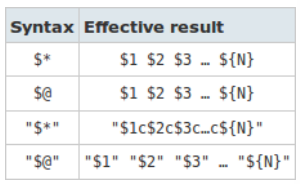

именованные аргументы (опции)

иногда аргументы надо передавать позиционно, а какието опции передавать с именем

```sh
while getopts 'hd:p:' opt; do
	case "$opt" in
		h) h=$OPTARG;;  #ожидаем букву `h` справа что делать
		p) p=$OPTARG;;
		d) d=$OPTARG;;
		
		*) (echo 'invalid arg'; exit 1);; # default
	esac
done
```

в ==`getopts`== есть список разрешенных аргументов `'hd:p:'`, если после аргумента может идти какоето значение то ставим `:`
==`$OPTARG`== - текущее значение этой переменной

Возвращаемое значение функций

Типы возвращаемых значений
- Статус код операции: 0 (ok)/ 1 (not ok) / другое 
- Значение

что увидеть статус код операции: ==`"$?"`==  

return
```sh
#!/usr/bin/env sh 

can_fail() { 
	if [ "$1" -eq 5 ]; then 
		echo 'error' 
		return 1 
	fi 
	
	echo 'correct' 
	return 0 
} 

can_fail 1 
echo "status code is: $?" 

can_fail 5 
echo "status code is: $?"
```

можно показывать успешно или нет

Значение через ==`$()`==

получаем значение

`subshell` новая концепция чтобы забирать значения из функции
```sh
#!/usr/bin/env sh 

can_fail() { 
	if [ "$1" -eq 5 ]; then 
		echo 'error' 
	else 
		echo 'correct' 
	fi 
} 

first=$(can_fail 1) 
echo "returns: $first code: $?" 

second=$(can_fail 5) 
echo "returns: $second code: $?"
```

==`return`== нужен для возвращения статус кода программы

___

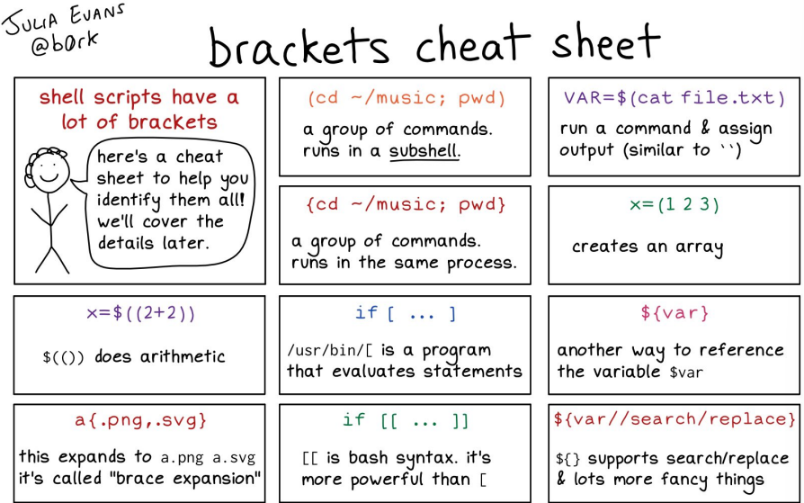

Файлы скриптов

Простой запуск

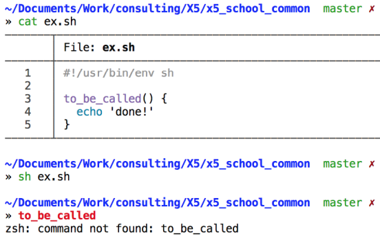

если файл скрипта неисполняемый то придется так запускать

в файле есть функция и после запуска файла она не пройдет в нашу среду 

- ==`source`== (есть `.`, но это нечитабельно)
	для импорта функций
	например `. shebang.sh`
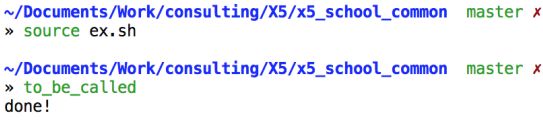

export переменных

фунции экспортируются по умолчанию, а переменные нет
```sh
#!/usr/bin/env sh 
MY_VARIABLE='value' 
export $MY_VARIABLE
```

Полезности
- ==`sudo`==
	для превышения своих полномочий

Работа с процессами

процесс - сущность ОС, в которой могут содержать много потоков

Процессы и потоки

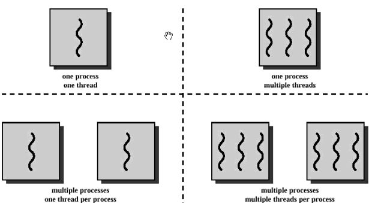

- ==`ps`==
	список текущих процессов
	неудобно использовать, только для скриптов

- ==`kill`==
	сигнал процессу

- ==`killall`==
	принудительно убить

```sh
#!/usr/bin/env sh 

kill -9 31154
#-9 сигнал закрытия
#31154 pid процесса

killall Chrome
```

- ==`htop`==
	продвинутый ps

Поиск по тексту

- ==`grep`==
	позволяет найти чтото по подстроке
	
	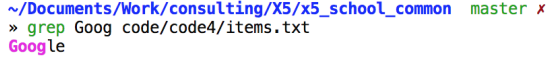

Удобные замены значительно быстрее
- https://github.com/ggreer/the_silver_searcher
- https://github.com/BurntSushi/ripgrep

Поиск файла

- ==`find`==
	1. Ищем в текущей папке файл по имени
	2. Поиск без расширения `*`
	3. Дополнительное ограничение что только файлы
	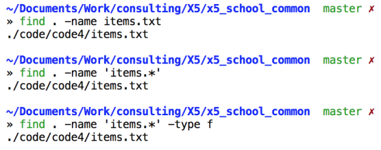

Удобные замены
- https://github.com/sharkdp/fd 
- https://github.com/junegunn/fzf (даже похожие или с опечатками)

Pipes

возможность сделать так чтобы 1 программа поделилась результатами с другой программой

Пайпы позволяют соединять команды воедино через |
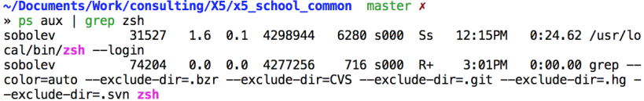
Алгоритм 
- Сначала делаем `ps aux` 
- По его результатам делаем `grep`

можно объединять скрипты

xargs – полезная штука для композиции пайпов (для обработки данных)
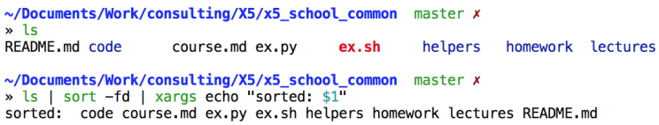

все файлы и папки
сортируем ==`-f`== игнор case; ==`-d`== по алфавиту
xargs - результат предыдущего пайпа придет как аргумент 

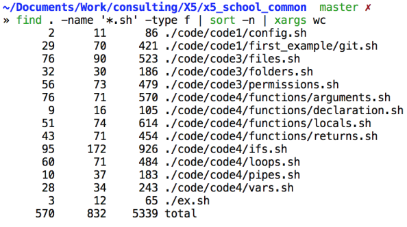

ищем все файлы в текущей директории с расширением .sh
сортируем по размеру
xargs wc - подсчет строк

удаление файлов

находим все файлы на .sh
терминируем все строки 0ым байтом
передаем значения в ==`xargs`== 
	==`-0`== разделение по 0му байту
	==`rm - rf`== удаляем навсегда
	
```sh
#!/usr/bin/env sh
find . -name "*.sh" -print0 | xargs -0 rm -rf
```

- ==`set`==
	позволяет выставлять способ как должен работать скрипт
	https://www.gnu.org/software/bash/manual/html_node/The-Set-Builtin.html
	- ==`-o errexit`== или ==`-e`== – падай на первой ошибке 
		если команда сбоит то дальше выполняться не будет иначе по умолчанию sh идет до конца
		
	- ==`-x`== – покажи команды, которые выполняются
		чтобы видеть какие команды выполняем
		
	- ==`-o nounset`== – падай на необъявленных переменных
		
	- ==`-o pipefail`== – падай на проблемах в pipes
	
	лучше всегда использовать при написании скриптов

- ==`ln`== `[название орига] [новый файл]` 
	позволяет делать линки (хард и софт)
	
	==`cp`== создает 2 разные копии файла, но если создадим линк то будет файл в котором изменения будут синхронизированы
	
	==`-s`== - символическая ссылка
		более простая ссылка в которой хранится путь до ориг файла


shellcheck 
спец программа для проверки скриптов на наличие ошибок 
https://www.shellcheck.net/

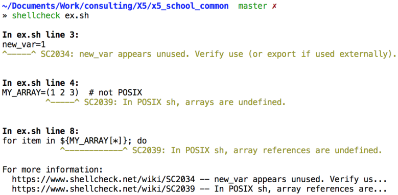

Выводы
- shell – вполне себе язык программирования 
- На нем нужно и можно писать инфраструктурный код (и даже делать большие проекты) 
- В Linux есть множество полезных примитивов для работы 
Множество готовых команд: только бери и делай!